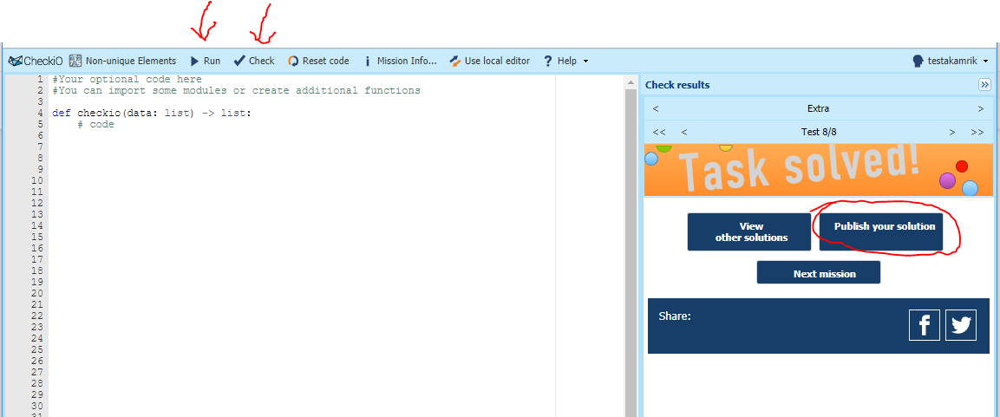

## Home assignment 1 - Python refresher
 - Due date: Wednesday, January 23rd by end of day
 - Submission: email your solution links (see below) to graderbot@kamrik.org
   - No attachments, just the links
   - The bot will not reply
 - Grading: this is a pass/fail assignment, no partial grades - you either get 100 if graderbot has your links, or 0 if it doesn't.
 
Solve the following 3 questions on checkio.org. Try to use NumPy where it makes sense.
 * https://py.checkio.org/en/mission/pawn-brotherhood/
 * https://py.checkio.org/en/mission/x-o-referee/
 * https://py.checkio.org/en/mission/long-repeat/

You can write your code in the browser or in an editor of your choice.
When ready to submit, copy your code to the browser and click the "Check" button.
Once all tests pass, click the "Publish" button on the right (see screenshot) and publish your solution. 
You will be taken to a page with your solution published, copy the link from the URL bar. The link will look like this:
```
https://py.checkio.org/mission/most-wanted-letter/publications/testakamrik/python-3/second/
```
Email the 3 links to graderbot@kamrik.org


